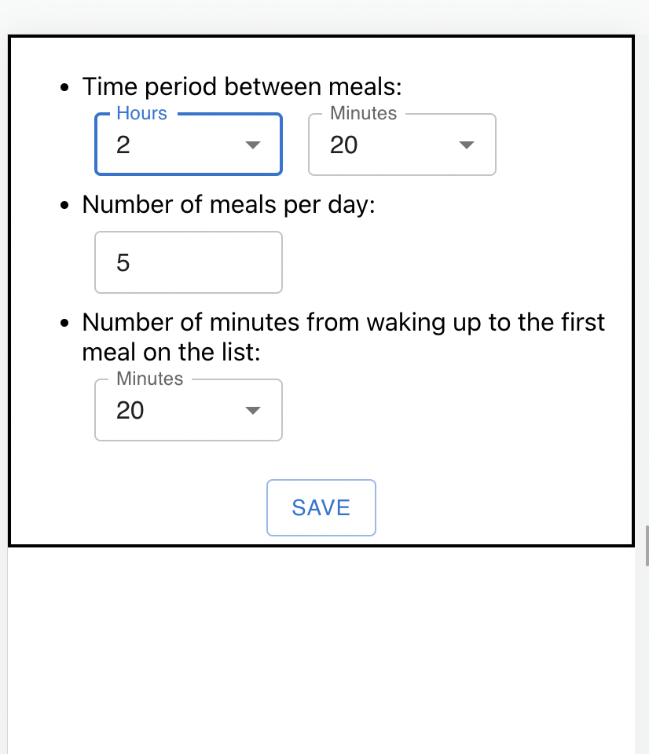
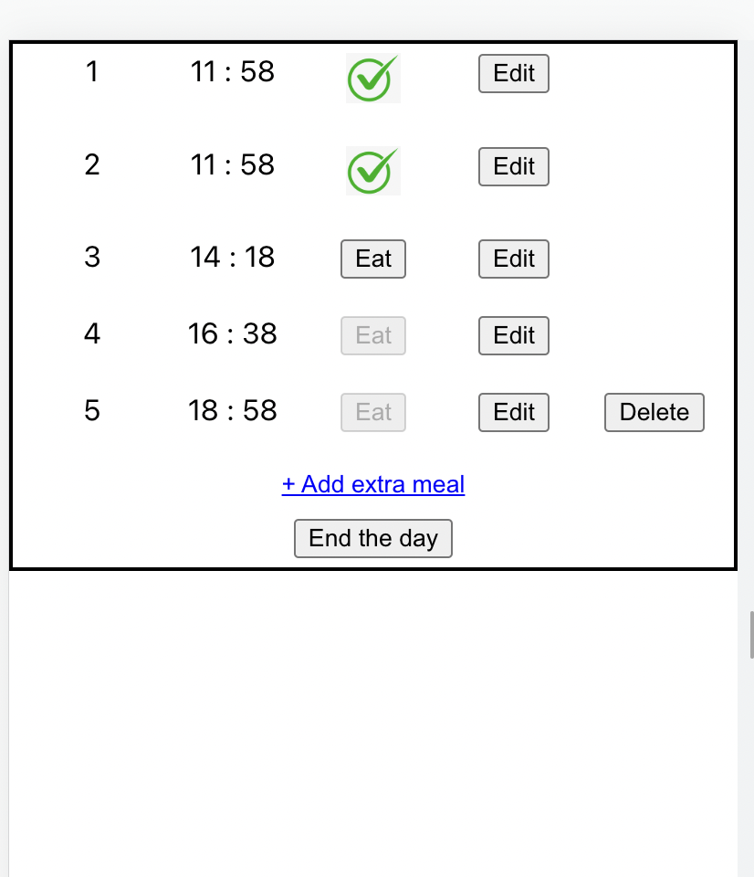
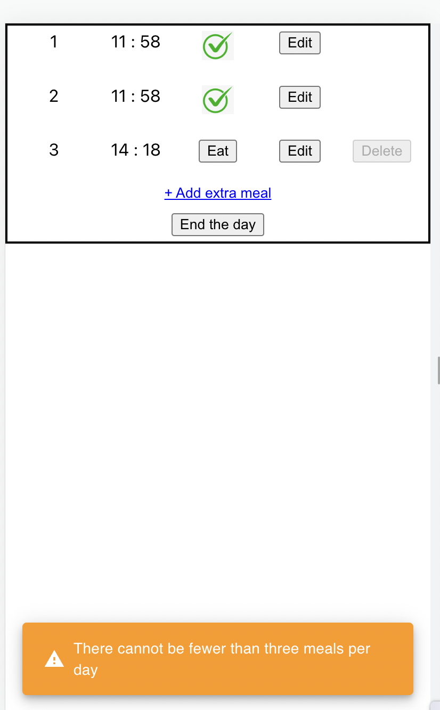

# Meal tracker

#### App written using JavaScript, React, Redux Toolkit, TypeScript, CSS, CSS Grid,CSS Flexbox, Material-UI, date-fns, Jest

Meal tracker is an app that helps you not to miss your daily meals. 

User enters settings: time period between meals, number a meal per day, number of minutes from waking up to the first meal on the list. 

These settings are saved in `Local Storage` and `Redux store`. Settings components were created using `Material-UI library`.

To generate a meal list for the day you need to click a button. *The button has a different name depending on the time of day*. If it is morning (time from 4:00 to 11:00) the button's name is 'Good morning!!!'. Other times the button is called 'Plan your meals'.

The meal list is generated based on the user's settings. The meal list is stored in `Local Storage` and `Redux store`. *The meal list persists after page reload*. Meal time is stored in milliseconds. To display the time for UI, milliseconds are converted to the format `"HH:MM"` using the `date-fns library` and the `mapper` pattern.

If the meal was eaten, press "Eat" button. When you press the "Eat" button, the meal time records the time the button was pressed. If the original time (calculated from the settings) does not match the button press time, all meal *times are recalculated* based on the new time data. When you press the "Eat" button the last meal for today, a Snackbar (use `useSnackbar hook`) appears, which offers to add an extra meal.

The user can edit meal time. If new time would be less than previous, the user sees snackbar with warning. If time was edited, all next meal times will be re-calculated.
All changes take place in Slice reducers (use `createSlice`).

The user can delete only the last meal. They cannot delete a meal if their total number will be less than 3.

The user can add extra meal if time of that extra meal would be less than 23:20.

"End the day" button ends meals for today, removes data from Redux store and Local Storage.

Some functions have been tested using `Jest`.

